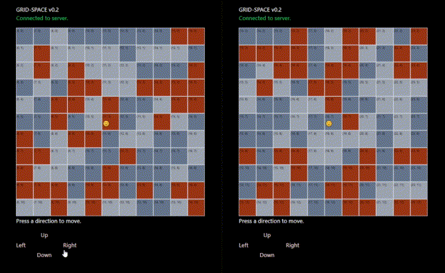

# Grid-Space: A Concurrent Multiplayer Web Application

<em>Demo of concurrency between two separate clients.</em>

## Overview
Grid-Space is a full-stack concurrent multiplayer web application designed for interactive gaming experiences. It leverages Go's powerful concurrency features to manage real-time communication between the server and multiple clients via websockets.

### Live Demonstration
### <strong>https://brthomiu.github.io/grid-space/</strong>

<em>Please be patient with the demo - the free hosting takes a bit of time to wake up and build a Docker image.</em>

### Server Component
- **Language:** Go
- **Concurrency:**
    - Batches messages from clients to ensure synchronization.
    - Executes game logic on regular ticks, maintaining consistency across all connected players.
- **Database:**
    - Utilizes an SQLite database on the server to store game data.
- **Server-Side Game Logic:**
    - **Secure:** By executing game logic on the server, sensitive operations and critical data remain protected from client-side manipulation.
    - **Single Source of Truth:** The server acts as the authoritative source for game state, ensuring consistent gameplay across all clients.
- **Deployment:**
    - **Local Run:** Run `main.go` from the /server directory to start the server locally.
    - **Dockerized Deployment:** Build the Docker image using the provided Dockerfile.

### Client Component
- **Language:** TypeScript
- **Framework:** React
- **Functionality:**
    - Dynamically re-renders game components based on data received from the server.
    - Facilitates seamless interaction between players.
- **Deployment:**
    - **Install Dependencies:** Run `npm i` from the /client directory to install dependencies for the client.
    - **Run Development Client:** Execute `npm run dev` from the /client directory to start the client locally.
    - **Build for Deployment:** Execute `npm run build` from the /client directory to build the client for deployment.
